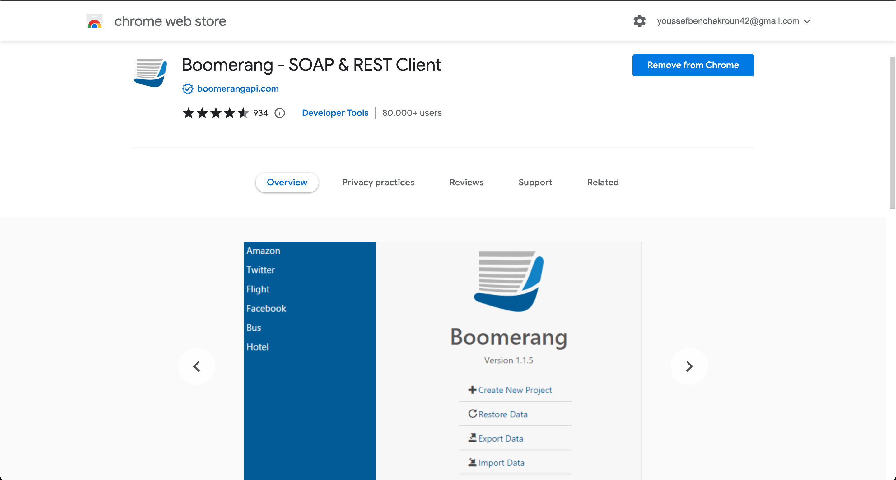
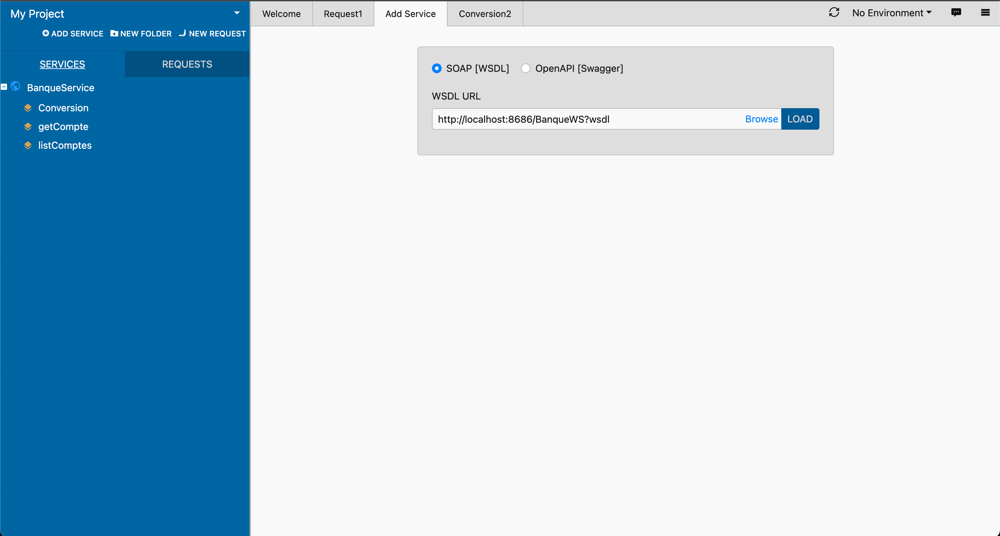
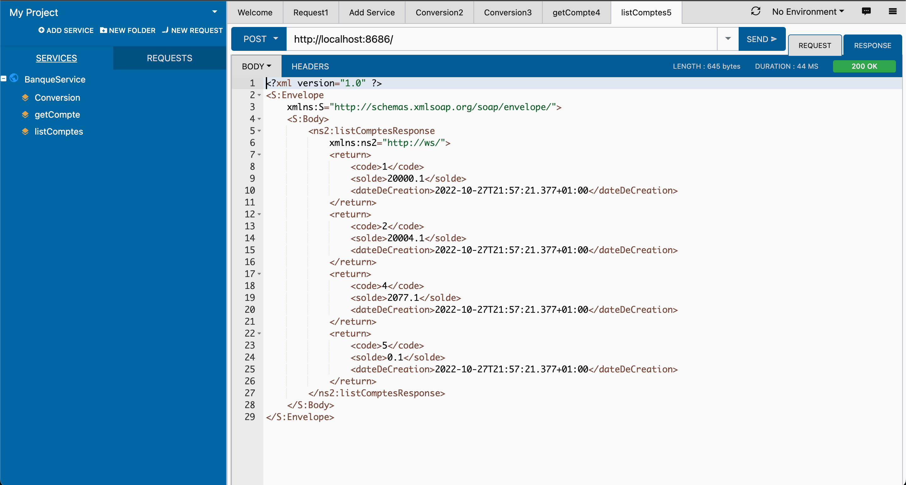
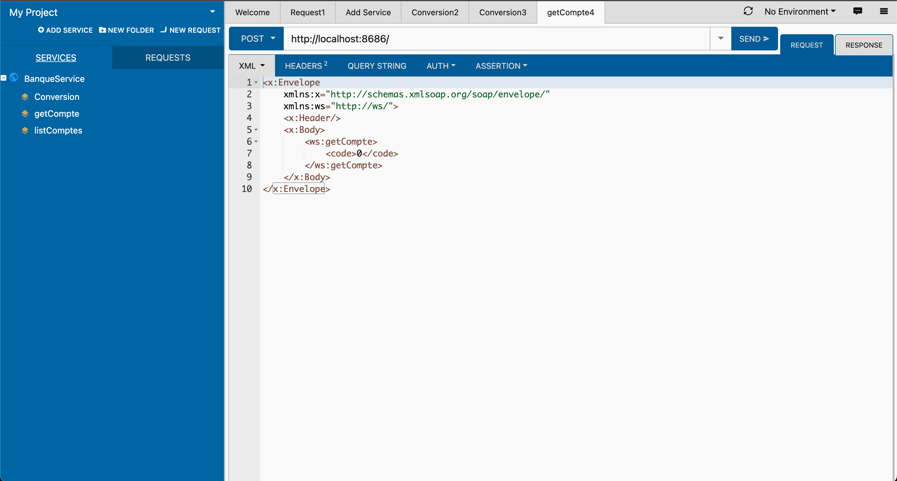
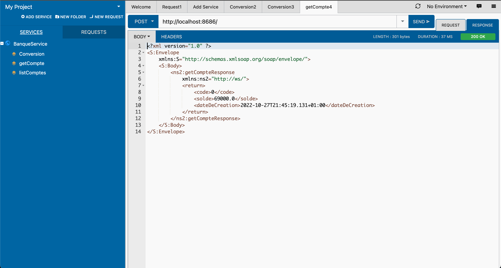
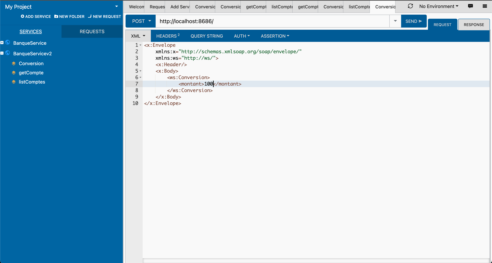
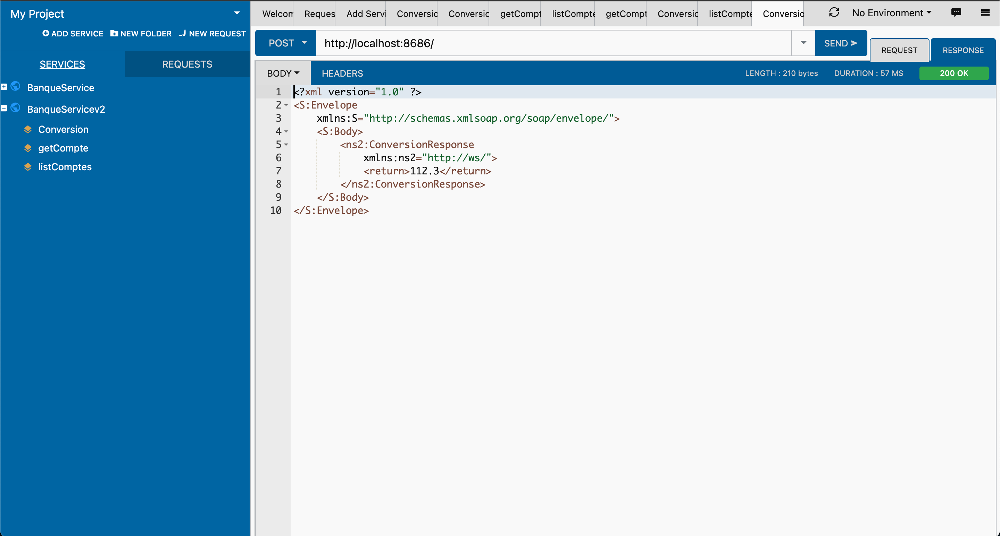

# Rapport de l'atelier 1: Web services Soap & Rest (Partie 1)
J'ai découvert une extension dans Chrome Extension Store qui m'a permis de tester mon web service comme SoapUI
(Boomerang - SOAP & REST Client)

## L'ajout de mon Web Service en utilisant le lien de son WSDL 

## La méthode listComptes

## La méthode getCompte (Request)

## La méthode getCompte (Response)

## La méthode de conversion (Request)

## La méthode de conversion (Response)

